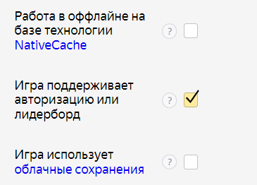
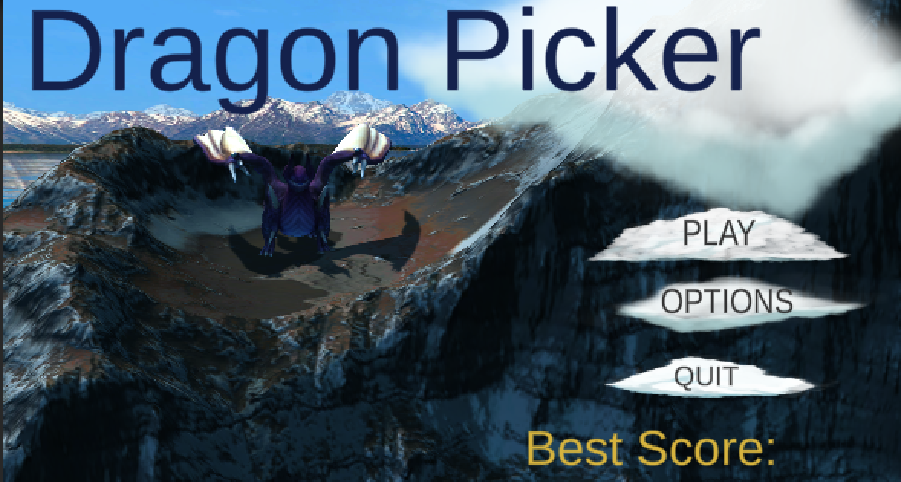
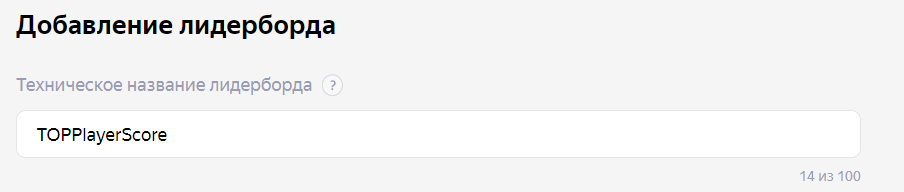
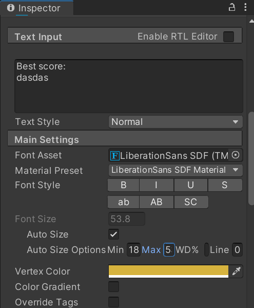

# Разработка игровых сервисов Лабораторная работа #5
Отчет по лабораторной работе #5 выполнил(а):
- Хафизова Анна Эдуардовна
- РИ300012
Отметка о выполнении заданий (заполняется студентом):

| Задание | Выполнение | Баллы |
| ------ | ------ | ------ |
| Задание 1 | * | 60 |
| Задание 2 | * | 20 |
| Задание 3 | # | 20 |

знак "*" - задание выполнено; знак "#" - задание не выполнено;

Работу проверили:
- к.т.н., доцент Денисов Д.В.
- к.э.н., доцент Панов М.А.
- ст. преп., Фадеев В.О.

[](https://nodesource.com/products/nsolid)

[](https://travis-ci.org/joemccann/dillinger)

Структура отчета

- Данные о работе: название работы, фио, группа, выполненные задания.
- Цель работы.
- Задание 1.
- Код реализации выполнения задания. Визуализация результатов выполнения (если применимо).
- Задание 2.
- Код реализации выполнения задания. Визуализация результатов выполнения (если применимо).
- Задание 3.
- Код реализации выполнения задания. Визуализация результатов выполнения (если применимо).
- Выводы.
- ✨Magic ✨

## Цель работы
Создание индивидуальной системы достижения пользователя и её интеграция в пользовательский интерфейс.


## Задание 1
### Используя видео-материалы практических работ 1-5 повторить реализацию приведённого ниже функционала.

Ход работы:

**1.   Интеграция авторизации с помощью Яндекс SDK.**
   
Создали новый скрипт **CheckConnectYG** и подключили его к свежесозданному пустому объекту **YandexManager**, который проверяет, соединена ли игра с **YandexSDK** и авторизован ли пользователь на платформе Яндекс Игры при помощи следующего кода:
```c#
public class CheckConnectYandex : MonoBehaviour
{
    private void OnEnable() => YandexGame.GetDataEvent += CheckSDK;
    private void OnDisable() => YandexGame.GetDataEvent += CheckSDK;

    void Start()
    {
        CheckSDK();
        
    }

    public void CheckSDK()
    {
        if (YandexGame.auth == true)
        {
            Debug.Log("User authorization ok");
        }
        else
        {
            Debug.Log("User not authorization");
            YandexGame.AuthDialog();
        }
    }
}
```

Далее билдим проект, и перегружаем архив с игрой на сайт Яндекс Игры.

В консоли разработчика Яндекс игр ставим галочку напротив функции «Игра поддерживает авторизацию или лидерборд», как показано на скриншоте ниже:


Теперь, если пользователь не будет авторизован на платформе Яндекс Игр, то платформа попросит его авторизоваться и в консоли выведет **User not authorization**. Если же пользователь будет авторизован, то консоль выведет **User authorization ok**.

**2. Сохранение данных пользователя на платформе Яндекс Игры.**


В скрипте **SavesYG** от **YandexSDK** добавим новую переменную score при помощи кода:

```c#
public int score;
```

Далее в скрипте **DragonPicker** подключим библиотеку **YG**. В методе **start()** добавим проверку подключения **YandexSDK** при помощи кода:

```c#
if (YandexGame.SDKEnabled == true)
        {
            GetLoadSave();
        }
```

И добавим сохранение счёта пользователя в Яндексе:

```c#
public void GetLoadSave()
    {
        Debug.Log(YandexGame.savesData.score);
    }

    public void UserSave(int currentScore)
    {
        YandexGame.savesData.score = currentScore;
        YandexGame.SaveProgress();
    }
```

Затем ещё раз забилдим проект с его дальнейшей выгрузкой на платформе Яндекс Игр. Убеждаемся в том, что игра сохраняет результаты набранных очков пользователя.

**3.  Сбор данных об игроке и вывод их в интерфейсе.**

Создадим на главном экране на **_0scene** новый текст со словами **«Best Score:»** и добавим такую же переменную в скрипт **SavesYG**. Новый текст с надписью можно увидеть на картинке ниже:


Далее в основной скрипт **DragonPicker** добавим строчки кода, которые будут позволять записывать счёт как **BestScore**, если он будет больше нынешнего:

```c#
if (currentScore > currentBestScore)
        {
            YandexGame.savesData.bestScore = currentScore;
        }
```

Также создадим ещё один новый текст для отображения **PlayerName** и подключим его к скриптам.

Таким образом была реализована система взаимодействия между игрой и информацией о пользователе с Яндекс платформы, позволяющая записывать максимально набранное игроком количество очков и получать имя пользователя для отображения его в игре.


**4. Интеграция таблицы лидеров.**

Добавим в основной скрипт **DragonPicker** таблицу лидербордов, также записав её техническое и отображаемое название на сайте Яндекс Разработчиков:


**5. Интеграция системы достижений в проект.**

Добавим новую кнопку **Achievement** на главный экран с меню. Добавим ей все необходимые свойства, которые разбирали на предыдущих лабораторных работах, и настроим отображение текста автоматически по размеру экрана, как показано на скриншоте ниже:
 

В скрипт **CheckConnectYG** добавим следующее условие, которое будет добавлять необходимые нам достижения в список достижений пользователя и выводить это на экране, реализованное кодом ниже:
```c#
        if (YandexGame.savesData.achivMent[0] == null & !GameObject.Find("ListAchieve"))
        {

        }
        else
        {
            foreach (string value in YandexGame.savesData.achivMent)
            {
                GameObject.Find("ListAchieve").GetComponent<TextMeshProUGUI>().text = GameObject.Find("ListAchieve").GetComponent<TextMeshProUGUI>().text + value + "\n";
            }
        }
    
```

И добавим достижение "Береги щиты!" в наш код:
```c#
string[] achieveList;
            achieveList = YandexGame.savesData.achivMent;
            achieveList[0] = "Береги щиты!";
            UserSave(int.Parse(scoreGT.text), YandexGame.savesData.bestScore, achieveList);

```

Таким образом, мы создали достижения, используя встроенные для этого системы YandexSDK.


## Задание 2
### Описать не менее трёх дополнительных функций Яндекс SDK, которые могут быть интегрированы в игру.

1. Внутриигровые покупки. Например, за возможность смены дракона (или его цвета) или персонажа-чародея, пользователю будет необходимо будет накопить опредёленное количество очков, которые будут выступать в роли валюты в игре для покупки акссесуаров.
2. Реклама после каждого n-ой проигрыша пользователя.
3. Возможность перевода игры на иностранные языки.
   

## Задание 3
### 	Доработать стилистическое оформление списка лидеров и системы достижений, разработанных в задании 1.


## Выводы

В ходе лабораторной работы я научилась многому, а именно: сохранению данных пользователя на платформе Яндекс Игры, интеграции авторизации с помощью Яндекс SDK, созданию таблицы лидеров и системы достижений в проекте.
 
✨Magic ✨

| Plugin | README |
| ------ | ------ |
| GitHub | [https://github.com/Den1sovDm1triy/DA-in-GameDev-lab1] |


## Powered by

**BigDigital Team: Denisov | Fadeev | Panov**
